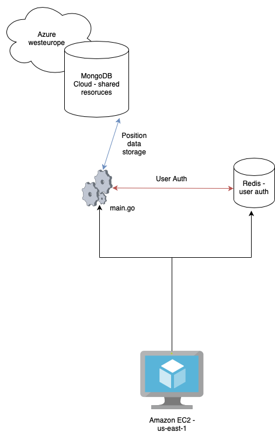

# DivTax documentation
The following is DivTax documentation. Work in progress.

Each module folder has `README.md` files with list of used functions, data structures and any other necessary data to work on code.

## Current architecture

## Current CICD pipeline 
`deploy.yml` trigger when PR is closed and merged to **main** branch. Deploy workflow has one job: *Build*, which runs on latest Ubuntu version available.

1. Setting up Go.
2. Checking out code.
3. Getting all dependencies.
4. Building a binary file.
5. Copying binary file to VM.
6. Copying template files.
7. Copying static files.
8. Creating .env file in `~` directory on VM.
9. Killing existing backend process.
10. Running new version of app on VM.
